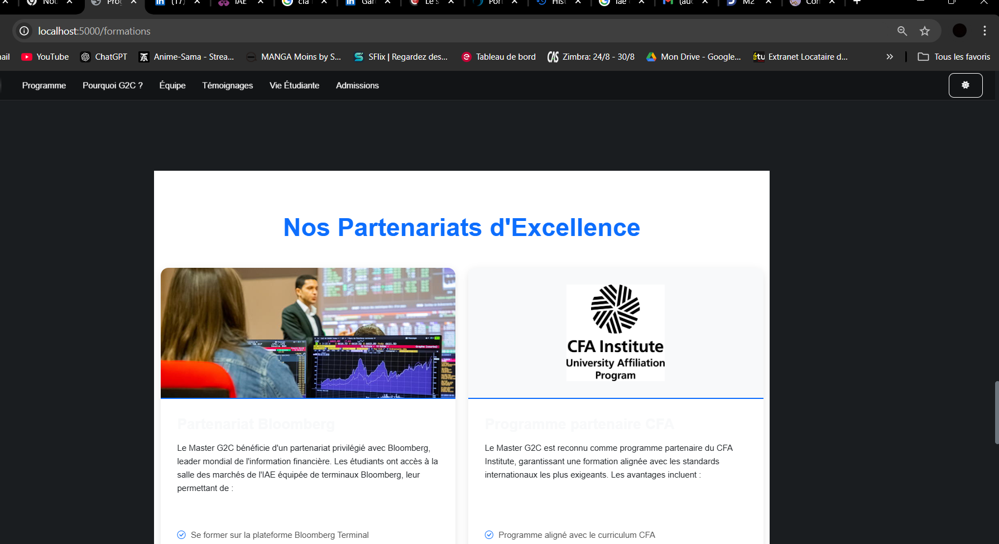

# UniSocial - Réseau Social Universitaire

UniSocial est une plateforme de réseau social interne conçue spécifiquement pour les universités. Elle permet aux étudiants et aux professeurs de partager des contenus, d'interagir et de rester connectés au sein de leur communauté universitaire.

## Fonctionnalités

- Authentification des utilisateurs (étudiants et professeurs)
- Publication de posts avec texte et images
- Système de likes
- Interface utilisateur moderne et responsive
- Filtrage par département universitaire
- Sécurité renforcée avec hachage des mots de passe

## Prérequis

- Python 3.8 ou supérieur
- pip (gestionnaire de paquets Python)

## Installation

1. Clonez ce dépôt :
```bash
git clone [URL_DU_REPO]
cd unisocial
```

2. Créez un environnement virtuel et activez-le :
```bash
python -m venv venv
venv\Scripts\activate  # Sur Windows
```

3. Installez les dépendances :
```bash
pip install -r requirements.txt
```

4. Initialisez la base de données :
```bash
python app.py
```

## Utilisation

1. Démarrez le serveur :
```bash
python app.py
```

2. Ouvrez votre navigateur et accédez à `http://localhost:5000`

3. Créez un compte en utilisant votre email universitaire

4. Commencez à partager du contenu avec votre communauté !

## Structure du projet

```
unisocial/
├── app.py              # Application principale Flask
├── requirements.txt    # Dépendances Python
├── static/            
│   └── uploads/       # Stockage des images uploadées
└── templates/         
    ├── index.html     # Page principale
    ├── login.html     # Page de connexion
    └── register.html  # Page d'inscription
```

## Sécurité

- Les mots de passe sont hachés avant d'être stockés
- Authentification requise pour accéder au contenu
- Validation des emails universitaires
- Protection contre les attaques CSRF

## Contribution

Les contributions sont les bienvenues ! N'hésitez pas à ouvrir une issue ou à soumettre une pull request.

## Licence

Ce projet est sous licence MIT. Voir le fichier `LICENSE` pour plus de détails.
